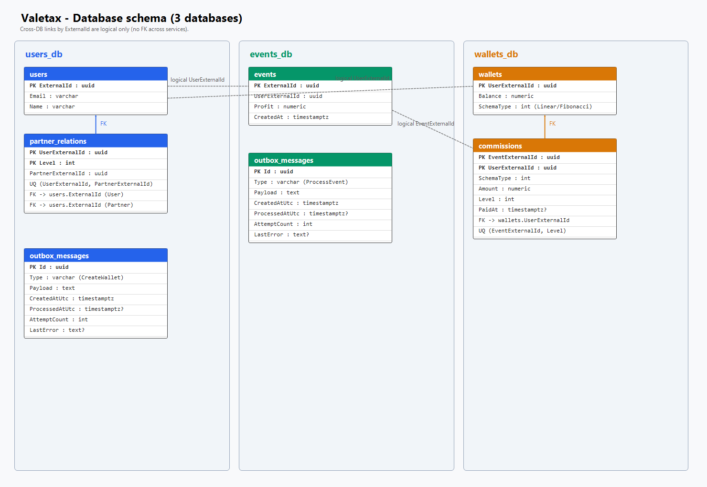

# Valetax test task

## Флоу выполнения задачи после анализа ТЗ

### 1. Выделил основные доменные сущности и разбил их на контексты по взаимодействию для организации микросервисной архитектуры

#### Сервис пользователей

Таблица пользователей - поля Email и Name для некого "очеловечивания" информации и более простого восприятия

Таблица связей пользователей - решено было сделать для оптимизации выборок, вместо прохода по всему дереву мы можем получить партнеров или рефералов пользователей по id. По ТЗ есть установка, но нет редактирования, поэтому выбрал этот вариант как более подходящий под кейс, также избавит от сложных выборок, циклов и CTE. Также по логике более частые операции просмотра (например для определения комиссии), нежели вставки

#### Сервис событий

Таблица событий

#### Сервис кошельков

Таблица кошельков - кошелек создается при создании пользователя, имеет схему начисления

Таблица комиссия - по сути результат обработки ивента

### 2. Определил способы общения между сервисами

#### Создание юзера -> создание кошелька

При помощи Outbox + http

Такой способ позволит не потерять кошелек и комиссии (если нет кошелька комиссии не отработают, но ивенты будут сохранены)

При превышении количества запросов предположим, что будет разбираться ТП по логам и записям в БД (дабы избежать усложнений логики)

#### Создание ивента -> обработка комиссии

При помощи Outbox + http

Опять же решаем проблему потери комиссии

Идемпотентность достигается уникальными ключами записей

### 3. Определил архитектуру сервера

Предпочитаю использовать Clean-архитектуру, тем более в микросервисах

Возможно такой вариант избыточен по слоям, для относительно небольшого приложения, но в данном случае хотелось сделать "красиво"

### 4. Определил подходы

Метрики: стандартные встроенные + логгирование (без всяких нагруженных систем, думаю это было бы избыточно)

Healthchecks: стандартные встроенные

Ошибки: кастомные + глобальные обработчик + логи

Маппинг: Mapster

Валидация: FluentValidation

Отказоустойчивость: Polly, Outbox, ct

Коммуникация с БД: EF + Repository с менеджером репозиториев

Тестирование: xUnit, нейминг - НазваниеМетода_Данные_ОжидаемыйРезультат, подход AAA

## Заключение

разработал отказоустойчивое приложение с асинхронным общением, потрогал Outbox паттерн, углубил свои знания и позакрывал гэпы.
Большая часть кода - нагенерена, моя работа заключалась в принятии архитектурных решений, делении контекстов, проработки логики общения, стека, подходу, кодстайлу, постоянному ревью и правками "как надо" (в правила напрмиер).
Сомневаюсь, что кому-то было бы интересно смотреть как я в очередной раз написал Clean-микросервис с репозиториями, бизнес-логикой и т.д.
В любом случае, задание оказалось очень крутым, я смог вынести для себя что-то новое, что-то потрогать руками!

---

# Далее - подробнее по стеку, развертыванию и т.д.

Система партнёрских комиссий: три ASP.NET Core API (**Users**, **Events**, **Wallets**) и PostgreSQL. Межсервисные write-вызовы идут через transactional outbox + HTTP.

## Требования

- [Docker Desktop](https://www.docker.com/products/docker-desktop/) (Compose v2)
- Для локальной сборки без Docker: [.NET 10 SDK](https://dotnet.microsoft.com/download)

## Быстрый старт (Docker)

Из корня репозитория (по 2 инстанса каждого API за nginx LB):

```bash
docker compose up --build --scale users-api=2 --scale events-api=2 --scale wallets-api=2
```

Без явного `--scale` поднимется по одному реплике каждого API — тоже через `gateway`.

Дождитесь старта всех контейнеров. EF-миграции применяются автоматически при запуске API.

Остановка:

```bash
docker compose down
```

Полный сброс данных Postgres (volume):

```bash
docker compose down -v
```

### Dev-режим (hot reload)

```bash
docker compose -f docker-compose.dev.yml up --build
```

Исходники монтируются в контейнеры, используется `dotnet watch`. Dev-стек без LB (по одному инстансу API на портах напрямую).

## Адреса

Внешний вход — **nginx gateway** (round-robin по репликам сервиса). Межсервисные вызовы Users/Events/Wallets тоже идут через него.

| Сервис   | HTTP                   | Swagger                              | Health                         |
|----------|------------------------|--------------------------------------|--------------------------------|
| Users    | http://localhost:5111  | http://localhost:5111/swagger        | http://localhost:5111/health   |
| Events   | http://localhost:5164  | http://localhost:5164/swagger        | http://localhost:5164/health   |
| Wallets  | http://localhost:5174  | http://localhost:5174/swagger        | http://localhost:5174/health   |
| Gateway  | nginx в Docker         | конфиг: `docker/nginx/nginx.conf`    | —                              |
| Postgres | localhost:5432         | user/password: `postgres` / `postgres` | —                            |

Базы: `users_db`, `events_db`, `wallets_db` (создаются скриптом `docker/postgres/init.sql`).

## Демо-данные (опционально)

После того как API хотя бы раз поднялись (таблицы уже созданы миграциями):

```bash
docker compose exec -T postgres psql -U postgres < docker/postgres/seed.sql
```

Иерархия: **Alice ← Bob ← Carol** (GUID совпадают с Postman-переменными).

## Проверка сценария

1. Импортируйте `postman/Valetax.postman_collection.json` в Postman.
2. Пройдите папки по порядку: Health → Users → Partner relations → Events → Wallets.
3. После создания события подождите 2–5 секунд (outbox заберёт сообщение и вызовет Wallets).

Либо вручную через Swagger на портах выше.

## Локальный запуск без полного Docker stack

1. Поднимите только Postgres (из compose или свой инстанс на `5432` с теми же БД/учётками).
2. Connection strings и URL соседних сервисов — в `*/API/appsettings.json` (`localhost` и порты из таблицы).
3. В отдельных терминалах:

```bash
dotnet run --project Users.API
dotnet run --project Events.API
dotnet run --project Wallets.API
```

Сборка / тесты:

```bash
dotnet build Valetax-test-task.slnx
dotnet test Wallets.Application.Tests
```

## Схема БД

Три отдельные базы (`users_db`, `events_db`, `wallets_db`). Связи между сервисами по `ExternalId` — логические (без cross-DB FK).


